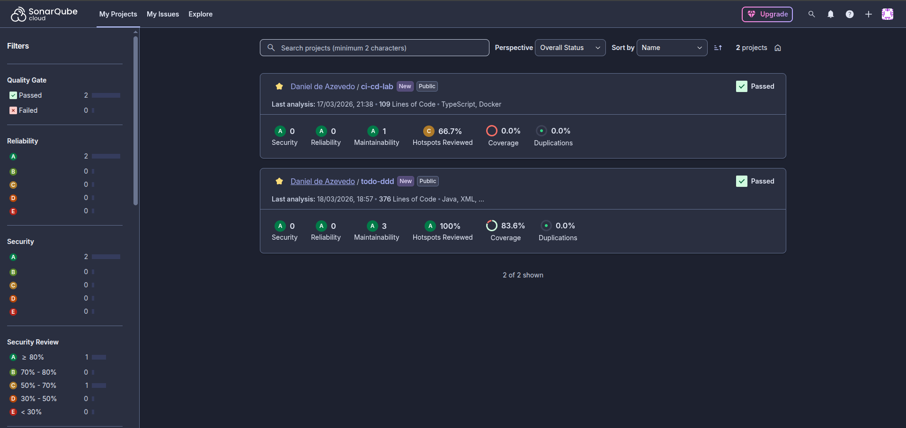
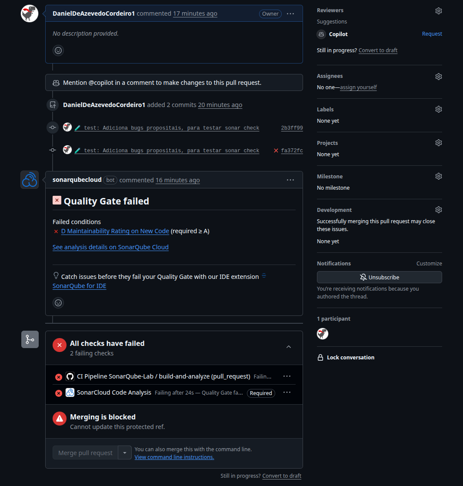

# SonarQube Lab

Laboratório com foco em CI usando sonarqube e jacoco.

## Fluxo

### Commit e Bloqueio na Develop: 

Push direto na branch `develop` está **bloqueado**. Qualquer nova alteração exige a criação de uma nova branch.

### Abertura do Pull Request (PR): 

Ao finalizar o desenvolvimento, o desenvolvedor deve abrir um Pull Request direcionado para a `develop`.

### Pipeline de Integração Contínua (CI):

A criação do PR aciona automaticamente o GitHub Actions. Esta pipeline é responsável por:
   - Fazer o build do projeto (Maven).
   - Rodar testes e emitir relatórios de cobertura de código (Jacoco).
   - Executar o Code Scan integrando os resultados com o SonarCloud/SonarQube.

# Overview

## Organizacao

## Verificação do Quality Gate:

O Sonar fará o checklist para avaliar Code Smells, Bugs, Vulnerabilidades e a porcentagem de Test Coverage.
   - O PR só é aprovado se o código passar pelas métricas estabelecidas no Quality Gate do Sonar

## Sonar Scan

## Merge:

Caso a PR passe com sucesso pelo pipeline ela esta liberada para o merge.

## Quality Gate

O Quality Gate e um conjunto de regras constomizaveis que fazem o diagnostico do codigo

